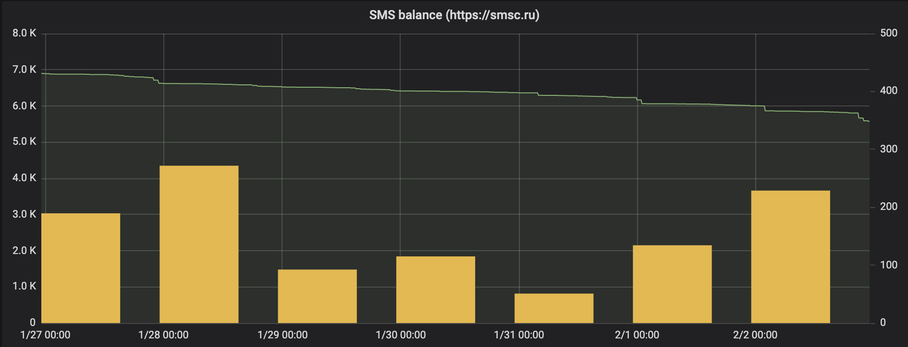

# Balance exporter for https://mcs.mail.ru service

The mcs balance exporter for [prometheus](https://prometheus.io) allows exporting balance for [mcs gateway](https://mcs.mail.ru)

- [How it works](#how-it-works)
- [Configuration](#configuration)
- [Command-line flags](#command-line-flags)
- [Running](#running)
  - [Running with docker](#running-with-docker)
  - [Running with docker-compose](#running-with-docker-compose)
  - [Running with systemctl](#running-with-systemctl)
- [Example configs](#example-configs)
  - [Example grafana config](#example-grafana-config)
  - [Example prometheus config](#example-prometheus-config)
  - [Example alert rules for prometheus](#example-alert-rules-for-prometheus)

## How it works

Exporter querying balance every hour (by default) and store it value in memory.
When prometheus make request, exporter retrieve balance value from memory for make response.

## Configuration

You must set environment variables:

- `MCS_LOGIN` - your login
- `MCS_PASSWORD` - your password

## Command-line flags

- `listen-address` - the address to listen on for HTTP requests. (Default: `0.0.0.0:9601`)
- `interval` - the interval (in seconds) for querying balance. (Default: `3600`)
- `retry-interval` - the interval (in seconds) for load balance when errors. (Default: `10`)
- `retry-limit` - the count of tries when error. (Default: `10`)

## Running

### Running with docker

```sh
docker run \
    -e MCS_LOGIN=<your-login> \
    -e MCS_PASSWORD=<your-password> \
    -p 9601:9601 \
    --restart=unless-stopped \
    --name mcs-balance-exporter \
    -d \
    alikhil/mcs-balance-exporter
```

### Running with docker-compose

Create configuration file. For example, file named `docker-compose.yaml`:

```yaml
version: "3"

services:
  mcs-balance-exporter:
    image: alikhil/mcs-balance-exporter
    restart: unless-stopped
    environment:
      MCS_LOGIN: <your-login>
      MCS_PASSWORD: <your-password>
    ports:
      - 9601:9601
```

Run exporter:

```sh
docker-compose up -d
```

Show service logs:
```sh

docker-compose logs -f mcs-balance-exporter
```

### Running with systemctl

Set variables you need:

```sh
MCS_EXPORTER_VERSION=v0.1.0
MCS_EXPORTER_PLATFORM=linux
MCS_EXPORTER_ARCH=amd64
MCS_LOGIN=<your_login>
MCS_PASSWORD=<your_password>
```

Download release:

```sh
wget https://github.com/alikhil/mcs-balance-exporter/releases/download/${MCS_EXPORTER_VERSION}/mcs_balance_exporter_${MCS_EXPORTER_VERSION}_${MCS_EXPORTER_PLATFORM}_${MCS_EXPORTER_ARCH}.tar.gz
tar xvzf mcs_balance_exporter_${MCS_EXPORTER_VERSION}_${MCS_EXPORTER_PLATFORM}_${MCS_EXPORTER_ARCH}.tar.gz
mv ./mcs_balance_exporter_${MCS_EXPORTER_VERSION}_${MCS_EXPORTER_PLATFORM}_${MCS_EXPORTER_ARCH} /usr/local/bin/mcs_balance_exporter
```

Add service to systemctl. For example, file named `/etc/systemd/system/mcs_balance_exporter.service`:

```sh
[Unit]
Description=MCS Balance Exporter
Wants=network-online.target
After=network-online.target

[Service]
Environment="MCS_LOGIN=${MCS_LOGIN}"
Environment="MCS_PASSWORD=${MCS_PASSWORD}"
Type=simple
ExecStart=/usr/local/bin/mcs_balance_exporter

[Install]
WantedBy=multi-user.target
```

Reload systemctl configuration and restart service

```sh
systemctl daemon-reload
systemctl restart mcs_balance_exporter
```

Show service status:

```sh
systemctl status mcs_balance_exporter
```

Show service logs:

```sh
journalctl -fu mcs_balance_exporter
```

## Example configs

### Example grafana config

Import dashboard from https://grafana.com/dashboards/9752 or use [examples/grafana.json](examples/grafana.json)


### Example prometheus config

[examples/prometheus.yaml](examples/prometheus.yaml)

```yaml
  - job_name: 'mcs_balance'
    scrape_interval: 1m
    static_configs:
      - targets:
        - '10.10.0.10:9601'
```

### Example alert rules for prometheus

[examples/prometheus-alert.rules](examples/prometheus-alert.rules)

```yaml
- name: balance
  rules:

  - alert: sms_balance
    expr: sum(balance_mcs{project="project-title"}) <= 2000
    for: 1s
    labels:
      severity: critical
    annotations:
      summary: "mcs balance is {{ .Value }} RUB"
      description: "Top up the balance: https://mcs.mail.ru/app/services/billing/"
```

## Credits

[Alexandr Paramonov](https://github.com/xxxcoltxxx) - author of [xxxcoltxxx/smsc-balance-exporter](https://github.com/xxxcoltxxx/smsc-balance-exporter) exporter.
